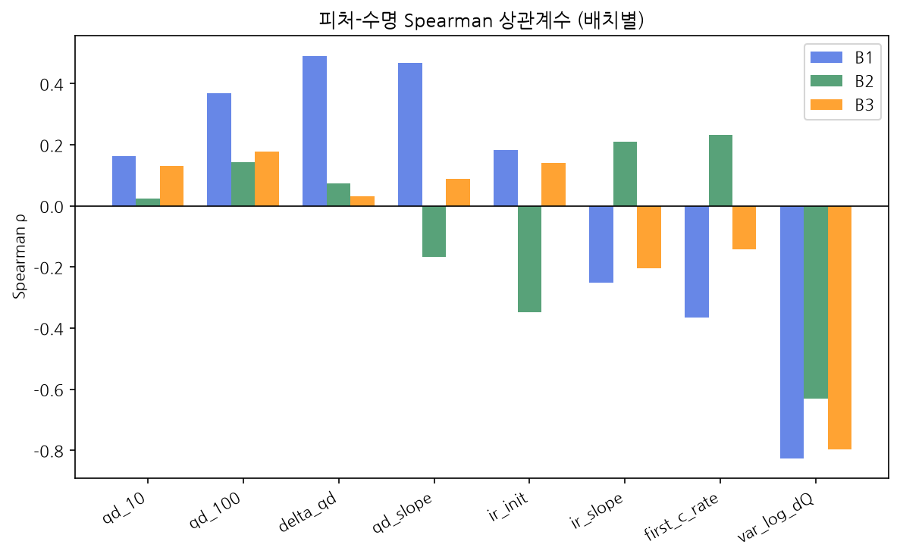
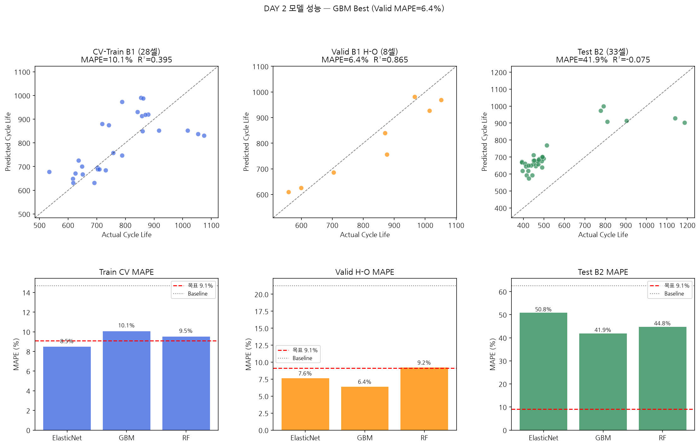
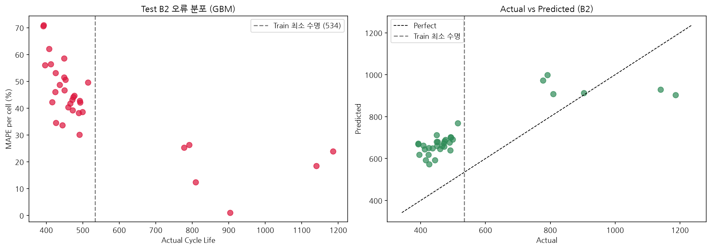

# ESS 배터리 수명 예측 — 모델 개발 및 평가

**Dataset:** MIT-Stanford Battery Dataset (Severson et al., Nature Energy 2019)  
**목표:** 초기 100사이클 데이터만으로 LFP 배터리 Cycle Life 예측 (MAPE 기준)

---

## 프로젝트 개요

- 학습: Batch 1 (36셀) / 평가: Batch 2 (33셀, 필수), Batch 3 (44셀, 추가)
- 태스크: Regression — Cycle Life 예측
- 평가 지표: MAPE (원논문 목표 ≤ 9.1%, Severson 2019 기준)


## 파일 구조

```
├── data/
│   ├── README.md              # 원시 데이터 설명 및 다운로드 링크
│   └── raw/                   # MIT-Stanford HDF5 파일 (미포함, 별도 다운로드)
├── notebooks/
│   ├── 01_EDA.ipynb           # 탐색적 데이터 분석
│   ├── 02_feature_engineering.ipynb  # 피처 분포 및 상관관계 분석
│   └── 03_modeling.ipynb      # 모델 학습 및 성능 리포팅
├── src/
│   ├── features.py            # 상수 정의 (FEATURES, CENSORED, BATCH_FILES)
│   ├── preprocess.py          # HDF5 → DataFrame 피처 추출
│   └── train.py               # 모델 학습·평가·Gap 계산·결과 저장
├── results/                   # 성능 CSV, JSON, 시각화 PNG
├── requirements.txt
└── README.md
```


## 환경 설정

```bash
git clone https://github.com/alswjd5789-del/ess-battery-lifecycle-prediction
cd ess-battery-lifecycle-prediction
python3 -m venv venv
source venv/bin/activate    # Windows: venv\Scripts\activate
pip install -r requirements.txt
```

> 원시 데이터는 용량 문제로 미포함. 다운로드: https://data.matr.io/1/projects/5c48dd2bc625d700019f3204  
> 다운로드 후 `data/raw/` 에 위치시키세요.


## 실행 방법

```bash
# 노트북을 순서대로 실행
jupyter notebook notebooks/01_EDA.ipynb
jupyter notebook notebooks/02_feature_engineering.ipynb
jupyter notebook notebooks/03_modeling.ipynb  # results/ 에 CSV·JSON·PNG 자동 생성
```


## EDA

### 데이터 구성

- **B1** 46셀 중 유효 36셀 (수명 534~1,074사이클, 600사이클 미만 3개)
- **B2** 47셀 중 유효 33셀 — 8개 Censored + 6개 IR 결측 제외 (수명 392~1,186사이클, 600사이클 미만 27개)
- **B3** 46셀 중 유효 44셀 (수명 541~1,935사이클, 600사이클 미만 1개)
- **핵심**: B2에만 단수명 셀 27개 집중 — B1 학습 범위 대비 심각한 외삽 구간, Test B2 성능 저하의 구조적 원인

### 열화 곡선

- Cycle 100 이전에 이미 장·단수명 셀 궤적이 갈라짐 → 조기 예측 피처 설계 근거
- 단수명 셀: 초기 급격한 열화 후 **Knee point** → 용량 급락

### ΔQ(V) 곡선

- `ΔQ(V) = Q(Cycle 100, V) − Q(Cycle 10, V)`: 전압 구간별 용량 변화량
- 단수명 셀: 2.0~3.5V 구간에서 음의 피크 넓고 깊음 / 장수명 셀: 0에 가깝고 좁음
- **핵심**: ΔQ 곡선 형태 자체가 수명 예측 신호 → `var_log_dQ = log₁₀(Var(ΔQ(V)))`로 수치화

### Spearman 상관 (B1 기준)

`var_log_dQ` −0.826 / `delta_qd` +0.491 / `qd_slope` +0.468 / `qd_100` +0.370 / `first_c_rate` −0.365 / `ir_slope` −0.252 / `ir_init` +0.182 / `qd_10` +0.163

- `var_log_dQ`: 배치 전반 −0.63~−0.83으로 압도적 일관성 (Severson 2019 재현)
- `delta_qd`(+0.491) > `qd_100`(+0.370) > `qd_10`(+0.163) → **LFP 활성화 범프**: Cycle 10→100 사이 용량이 증가한 셀이 장수명 경향, 절대값보다 변화량이 유효




## Modeling

### 데이터 분할

- Train: B1 80% → 28셀 / Valid (Hold-out): B1 20% → 8셀 / Test: B2 33셀 / Additional: B3 44셀
- 80/20 분리 (`random_state=42`): 소규모 데이터셋(36셀)에서 Valid 셀 수 확보를 위한 일반적 비율
- **Valid로 모델 선택**: Test 데이터 미참조 → 데이터 누수 방지
- B2 IR 결측 6개 셀(cells 42–47) 제외 → Test set에 장수명 셀 일부(841·997·1,029사이클) 미포함. 장수명 구간은 MAPE가 낮으므로(700~900사이클 21.3%, >900사이클 14.5%) 제외로 인해 B2 MAPE가 비관적(보수적)으로 편향될 수 있음
- 한계: Valid 8셀 소규모로 모델 선택 불안정 / 랜덤 분할로 동일 충전 프로토콜 셀 Train·Valid 혼재 가능 (GroupShuffleSplit으로 개선 여지)

> 원논문 9.1% 목표는 B1+B2 혼합 41셀 학습 기준 — 본 실험(B1 36셀 단독)과 직접 비교 불가

### 피처 (8개)

Severson et al. (2019) 기반 선정, 전부 Cycle 100 이전 데이터만 사용:

- `qd_10` — Cycle 10 방전 용량 (Ah)
- `qd_100` — Cycle 100 방전 용량 (Ah)
- `delta_qd` — qd_100 − qd_10 (초기 용량 변화량)
- `qd_slope` — QD 선형 기울기 (cycles 2–100)
- `ir_init` — 초기 내부 저항 평균 (cycles 2–5, Ω)
- `ir_slope` — IR 선형 기울기 (cycles 2–100)
- `first_c_rate` — Cycle 2 평균 충전 전류 (QCharge×60/chargetime, A)
- `var_log_dQ` — log₁₀(Var(ΔQ(V))): 전기화학적 불균일성, Severson 원식 핵심 피처

> `var_log_dQ`는 RF 중요도(0.71) 및 ElasticNet 계수 절댓값 기준 **1위** — 트리 기반·선형 모델이 서로 다른 방식으로 동일 피처를 최우선 선택 (GBM도 동일 패턴)

### 모델 선택

후보 3종: **ElasticNet** (다중공선성 대응, 선형 기저), **GBM** (비선형 상호작용), **RF** (앙상블, 분산 감소)

최종 선택: **GBM** — Valid MAPE 6.41%로 최저 (ElasticNet 7.64%, RF 9.23%)  
선택 기준: Valid MAPE (Test 미참조 — 데이터 누수 방지), Baseline(21.26%) 대비 모든 모델 개선 확인  
사후 검증: B2 최종 성능에서도 GBM(41.93%) < RF(44.78%) < ElasticNet(50.83%) — Valid 1위(GBM)가 Test에서도 1위 유지 (단 2·3위는 RF/ElasticNet 순서 역전)  
한계: GBM Train CV MAPE(10.07%)는 세 모델 중 가장 높음(ElasticNet 8.47%, RF 9.52%) — hold-out 8셀 기반 선택으로 불안정성 존재, 셀 수 증가 시 CV 선택 권장


## 성능 결과

최종 모델: **GBM** (Valid MAPE 기준 선택 / ElasticNet 7.64%, RF 9.23% 대비 최저)  
Baseline (Train 평균 상수 예측): Train 14.70% / Valid 21.26% / Test B2 62.59% / B3 24.21% — 모든 ML 모델이 Valid·B2·B3 전 구간에서 Baseline 대비 개선

**Batch 2 (Test)**

| 구분 | MAPE (%) | 비고 |
|---|---|---|
| Train (Batch 1 CV) | 10.07% | |
| Valid (Batch 1 Hold-out) | 6.41% | |
| Test (Batch 2) | 41.93% | |
| Gap (Train-Valid) | −3.67%p | (+): 과적합 의심 → 음수, 과적합 징후 없음 (단 Valid 8셀 소규모로 우연 변동 가능) |
| Gap (Valid-Test) | +35.52%p | (+): 배치간 일반화 저하 의심 |
| Gap (Target-Test) | +32.83%p | Target: 원논문 9.1% |

**Batch 3 (Additional)**

| 구분 | MAPE (%) | 비고 |
|---|---|---|
| Test (Batch 3) | 16.82% | |
| Gap (Batch2-Batch3) | −25.11%p | Test 성능 간 비교 |
| Gap (Target-Test) | +7.72%p | Batch 3 기준, 원논문 9.1% 대비 |




## 오류 분석

- **대상**: B2 단수명 셀 27개 (실제 수명 392~514사이클)
- **GBM 예측**: 573~769사이클로 과대 예측 (실제보다 147~279사이클 높게)
- **반대 방향 오차**: B2 최장수명 셀(1,186사이클)은 283사이클 과소 예측 → 양 끝단 모두 B1 학습 범위 밖에서 오차 확대
- **GBM B2 R²**: −0.075 (설명력 음수 — 평균 예측보다 못함)
- **수명 구간별 MAPE**: <500사이클(n=26) 47.2% / 500~700(n=1) 49.6% / 700~900(n=3) 21.3% / >900(n=3) 14.5%

**원인**: B1의 600사이클 미만 셀은 3개뿐이나 B2는 27개 — 단수명 구간 심각한 외삽 발생. ElasticNet·GBM·RF 모두 42~51%로 수렴 → 모델 선택보다 학습 데이터 분포의 한계가 지배적 요인. B3 MAPE는 16~18%로 개선되나 R²는 −0.11~−0.17 (B3 고수명 셀이 B1 최대 수명 초과해 상위 구간도 외삽).

**개선 방향**: B1+B2 혼합 학습 / 도메인 적응 기법 / 단수명 셀 데이터 보강




## ESS 도메인 해석

- 초기 100사이클 데이터만으로 수명 예측 → 예방 정비 스케줄링 자동화에 활용 가능성
- 납품 초기 단수명 셀 선별 → QA 프로세스 강화. 단 현 모델은 B2 단수명 셀을 과대 예측하므로 단수명 셀 데이터 보강 후 적용 필요 (`var_log_dQ`는 배치 간 Spearman −0.63~−0.83으로 선별 신호로서 일관성 확인)
- GBM B3 MAPE 16.82%는 Baseline(24.21%) 대비 개선되나, R²=−0.17로 개별 셀 수준 설명력은 제한적(평균 상수 예측보다 낮음) → 실 배포 전 추가 데이터 확보 필요
- 한계: 학습 외 충전 프로토콜·운영 조건 일반화 제한 / 현장 변수(온도·SOC) 미반영


## 참고문헌

Severson et al. (2019). Data-driven prediction of battery cycle life before capacity degradation. *Nature Energy*, 4, 383–391.


## 팀 구성

**김민정** (울산 1반 / SKALA SK AX) — EDA, 피처 엔지니어링, 모델 개발, 성능 평가
